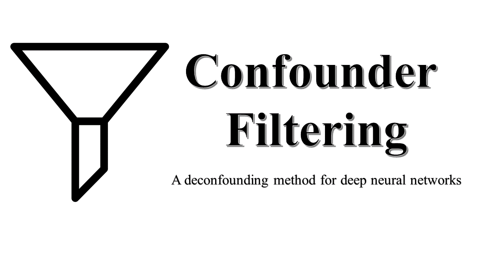

# Confounder Filtering Method

Example implementation of this paper:

H. Wang, Z. Wu and E. P. Xing, [Removing Confounding Factors Associated Weights in Deep Neural Networks Improves the Prediction Accuracy for Healthcare Applications](https://psb.stanford.edu/psb-online/proceedings/psb19/wang.pdf), Proceedings of 24th Pacific Symposium on Biocomputing (PSB 2019).

## Method Introduction

Confounder filetering (CF) method is an interesting method that helps to improve the generalization of neural networks by removing the weights that are associated with confounding factors. In contrast to many methods that work with the representation learned through the data, we directly work with the weights that will result in the representation. 

## File Structure:

* [vanilla/](https://github.com/HaohanWang/CF/tree/master/vanilla) example files of the baseline vanilla CNN
* [CF/](https://github.com/HaohanWang/CF/tree/master/CF) example files of CF method
* By comparing the differences between these two files, one should have a better idea about how to plugging CF method into an arbitrary model, specifically:   
    - cnn.py defines two extra terms
        - [Line 60](https://github.com/HaohanWang/CF/blob/master/CF/cnn.py#L60) defines `self.layer`
        - [Line 62](https://github.com/HaohanWang/CF/blob/master/CF/cnn.py#L62) defines `setWeights()`
    - run.py splits into three phases
        - [Phase 1](https://github.com/HaohanWang/CF/blob/master/CF/run.py#L91) is roughly the same as vanilla method, with an extra step to save weights at [Line 140](https://github.com/HaohanWang/CF/blob/master/CF/run.py#L140)
        - [Phase 2](https://github.com/HaohanWang/CF/blob/master/CF/run.py#L143) starts at Line 143
        - [Phase 3](https://github.com/HaohanWang/CF/blob/master/CF/run.py#L161) starts at Line 161
        

## Contact
[Haohan Wang](http://www.cs.cmu.edu/~haohanw/)
&middot;
[@HaohanWang](https://twitter.com/HaohanWang)
